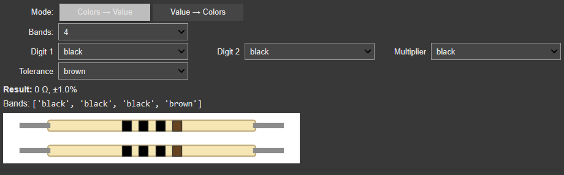
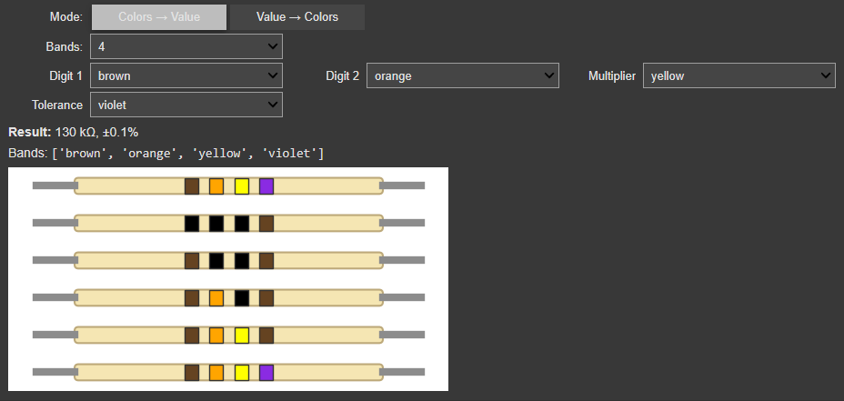

# Universal Resistor Color Code Identifier

[](https://colab.research.google.com/github/<USER>/<REPO>/blob/main/Universal_Resistor_Color_Code_Identifier.ipynb)


Interactive tool to decode **resistor color bands** and to **generate bands from a value**.  
Supports **3, 4, 5 and 6-band** resistors, including **tolerance** and **temperature coefficient**.  
The notebook includes a **Matplotlib visual** of the resistor body with the selected bands.

---

## Repo structure
```
Universal_Resistor_Color_Code_Identifier.ipynb
universal_resistor_color_code_identifier.py
images/
  Resistor Color Code.JPG
  Universal_Resistor_Color_Code_Identifier.png
  Universal_Resistor_Color_Code_Identifier_2.png
requirements.txt
README.md
LICENSE
```
> If your filenames differ, update paths accordingly in the README.

## Quick start (Colab)
Click the **Colab** badge above → `Runtime → Run all` → interact with the widget.

## Local use
```bash
python -m venv .venv && source .venv/bin/activate  # Windows: .venv\Scripts\activate
pip install -r requirements.txt

# Jupyter/Colab-style UI
jupyter notebook Universal_Resistor_Color_Code_Identifier.ipynb

# CLI fallback
python universal_resistor_color_code_identifier.py
```

## Minimal API usage (from the .py file)
```python
from universal_resistor_color_code_identifier import (
    colors_to_value, value_to_colors, describe_colors, draw_resistor
)

print(colors_to_value(['orange','orange','red','gold']))     # 3.3 kΩ ±5%
print(value_to_colors(33000, bands=4, tolerance='gold'))     # -> ['orange','orange','red','gold']
```

## Mappings (IEC)
- **Digits**: black=0, brown=1, red=2, orange=3, yellow=4, green=5, blue=6, violet=7, grey=8, white=9  
- **Multiplier**: silver=×0.01, gold=×0.1, black=×1, brown=×10, red=×100, orange=×1k, yellow=×10k, green=×100k, blue=×1M, violet=×10M, grey=×100M, white=×1G  
- **Tolerance**: brown=±1%, red=±2%, green=±0.5%, blue=±0.25%, violet=±0.1%, grey=±0.05%, gold=±5%, silver=±10%, none=±20%  
- **Temp. Coeff. (ppm/K)**: black=250, brown=100, red=50, orange=15, yellow=25, green=20, blue=10, violet=5, grey=1, white=1000

## Screens
<p align="center">
  <br/>
  <em>Interactive UI (Colors → Value)</em>
</p>
<p align="center">
  <br/>
  <em>Interactive UI (Value → Colors)</em>
</p>

## Topics
Add these in the repo “About → Topics”:  
`electronics, resistor, color-code, ohms, ece, python, jupyter, colab, ipywidgets, matplotlib, calculator, education, embedded-systems`

## License
MIT © <Ahnaf Atef>
