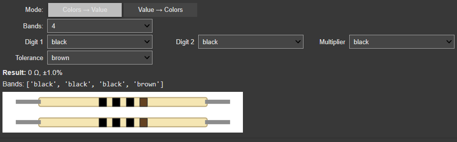
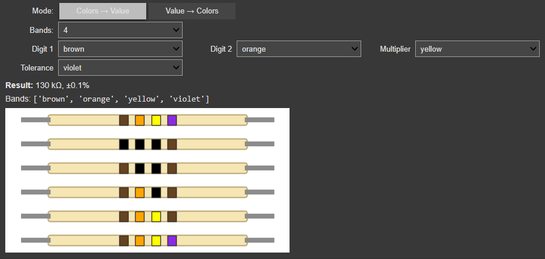

# Universal Resistor Color Code Identifier

[](https://colab.research.google.com/github/Techro0/universal-resistor-color-code-identifier/blob/main/Universal_Resistor_Color_Code_Identifier.ipynb)


An interactive, **Colab‑ready** tool to decode **resistor color bands** and to **generate bands from a value**.  
Supports **3, 4, 5, and 6‑band** resistors, including **tolerance** and **temperature coefficient** for 6‑band parts.  
Includes a **Matplotlib visual** that draws the resistor body with your selected bands.

---

## ✨ Features
- **Colors → Value** (Ω / kΩ / MΩ / GΩ) with tolerance and temp‑coeff (ppm/K)
- **Value → Colors** for 3/4/5/6 bands (handles gold/silver multipliers)
- **Interactive UI** via `ipywidgets` (Colab & Jupyter)
- **CLI fallback** and **importable API** (`colors_to_value`, `value_to_colors`, `draw_resistor`, `describe_colors`)

---

## 🚀 Quick Start (Colab)
Click the badge at the top or open:  
`https://colab.research.google.com/github/Techro0/universal-resistor-color-code-identifier/blob/main/Universal_Resistor_Color_Code_Identifier.ipynb`

Run all cells and use the widget to choose **mode**, **band count**, and **colors**.

---

## 💻 Local Setup
```bash
python -m venv .venv && source .venv/bin/activate   # Windows: .venv\Scripts\activate
pip install -r requirements.txt

# Notebook UI
jupyter notebook Universal_Resistor_Color_Code_Identifier.ipynb

# Or CLI
python universal_resistor_color_code_identifier.py
```

### Minimal API
```python
from universal_resistor_color_code_identifier import (
    colors_to_value, value_to_colors, describe_colors, draw_resistor
)

print(colors_to_value(['orange','orange','red','gold']))  # 3.3 kΩ ±5%
print(value_to_colors(33000, bands=4, tolerance='gold'))  # -> ['orange','orange','red','gold']

# Optional visual
import matplotlib.pyplot as plt
bands = ['orange','orange','red','gold']
fig, ax = draw_resistor(bands); plt.show()
```

---

## 📁 Repo Structure
```
Universal_Resistor_Color_Code_Identifier.ipynb
universal_resistor_color_code_identifier.py
images/
  Resistor Color Code.JPG
  Universal_Resistor_Color_Code_Identifier.png
  Universal_Resistor_Color_Code_Identifier_2.png
requirements.txt
README.md
LICENSE
.gitignore
```

---

## 📊 Mappings (IEC)
- **Digits**: black=0 · brown=1 · red=2 · orange=3 · yellow=4 · green=5 · blue=6 · violet=7 · grey=8 · white=9  
- **Multiplier**: silver=×0.01 · gold=×0.1 · black=×1 · brown=×10 · red=×100 · orange=×1k · yellow=×10k · green=×100k · blue=×1M · violet=×10M · grey=×100M · white=×1G  
- **Tolerance**: brown=±1% · red=±2% · green=±0.5% · blue=±0.25% · violet=±0.1% · grey=±0.05% · gold=±5% · silver=±10% · none=±20%  
- **Temp. Coeff. (ppm/K)**: black=250 · brown=100 · red=50 · orange=15 · yellow=25 · green=20 · blue=10 · violet=5 · grey=1 · white=1000

---

## 🖼️ Screens
<p align="center">
  <br/>
  <em>Colors → Value</em>
</p>
<p align="center">
  <br/>
  <em>Value → Colors</em>
</p>

---

## 🔎 Topics
Add these in the repo “About → Topics”:  
`electronics, resistor, color-code, ohms, ece, python, jupyter, colab, ipywidgets, matplotlib, calculator, education, embedded-systems`

---

## 📄 License
MIT © Techro0
